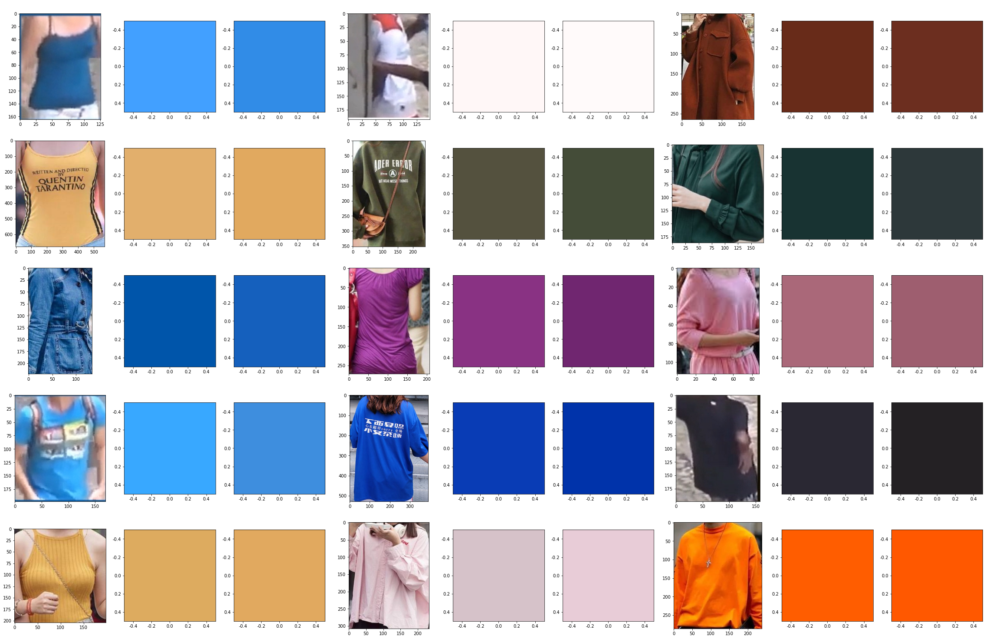

# Color Detection



## Introduction

The "color-detection" project is a Python program that analyzes images to identify and predict the closest matching colors for the prominent colors in the images. It uses a predefined color palette to make predictions based on the RGB values of the colors in the images.

## Features

- Build an extensive color code database.
- Load and display images.
- Extract HSV color features from images.
- Convert HSV colors to RGB and RGB to HEX color codes.
- Calculate color differences using the Euclidean distance formula.
- Predict and display the closest matching color for each image.

## Installation

To run the "color-detection" program, follow these steps:

1. Clone the repository to your local machine:

    ```
    git clone https://github.com/your-username/color-detection.git
    ```

2. Navigate to the project directory:

    ```
    cd color-detection
    ```

3. Install Jupyter Notebook using pip if you haven't already:

    ```
    pip install notebook
    ```

## Usage

1. Add your images to the `images` directory within the project folder.

2. Open a terminal and navigate to the project directory.

3. Start Jupyter Notebook by running the following command:

    ```
    jupyter notebook
    ```

4. In the Jupyter Notebook interface, open `color_detection.ipynb` to run the program.

5. The program will analyze the images in the `images` directory and display the original images, their prominent color in RGB format, and the predicted closest matching color along with its HEX color code and the calculated color difference.

## Notebooks

- The main notebook for this project is `color_detection.ipynb`.

## License

This project is licensed under the MIT License - see the [LICENSE](LICENSE) file for details.

## Acknowledgments

- The predefined color palette and color matching algorithm are based on Wikipedia's color code data.
- The extensive color code database is a valuable resource for precise color matching.
